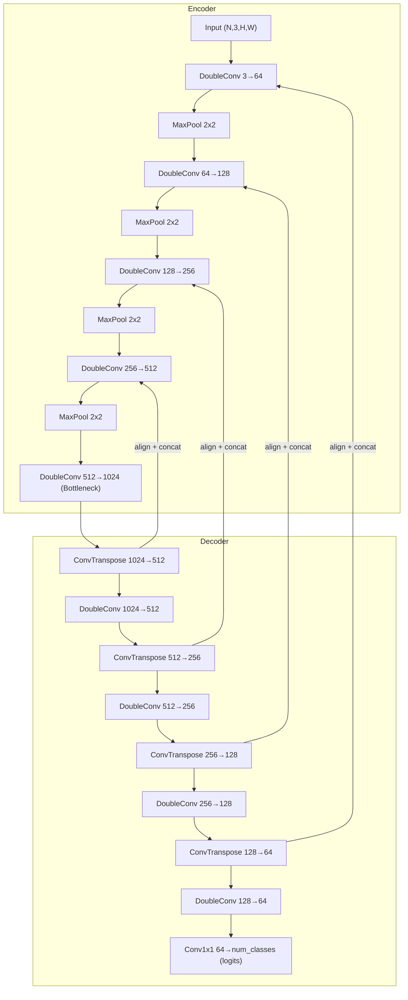

# Computer Vision Portfolio: U-Net Segmentation & YOLOv8 Detection

[](https://www.python.org/)
[](https://pytorch.org/)
[](https://docs.ultralytics.com/)
[](LICENSE)

A single notebook covering both major paradigms of dense visual understanding — **pixel-level segmentation** and **instance-level detection** — implemented with two very different but equally important engineering skills: building a model from first principles, and shipping a production-grade transfer-learning pipeline.

## Project Overview

| | |
|---|---|
| **Part 1** | A U-Net built from raw `nn.Conv2d` / `nn.MaxPool2d` / `nn.ConvTranspose2d` primitives, trained end-to-end on a self-contained synthetic shape-segmentation dataset (no external downloads required). Includes a combined BCE + Dice loss, IoU/Dice evaluation, and dynamic crop/pad handling so the network accepts **any** input resolution. |
| **Part 2** | YOLOv8 (Ultralytics) fine-tuned on `coco8.yaml`, with training-curve visualization and robust, exception-handled inference on a real traffic video. |

This repo is meant to demonstrate two complementary strengths: the ability to reason about and implement architecture internals from scratch, and the ability to work efficiently and safely with industry-standard, production-grade CV tooling.

## Tech Stack

- **Language:** Python 3.10+
- **Deep Learning:** PyTorch, torchvision
- **Object Detection:** Ultralytics YOLOv8
- **Computer Vision / I/O:** OpenCV (`cv2`)
- **Data / Viz:** NumPy, pandas, Matplotlib
- **Tooling:** tqdm (progress bars), Jupyter Notebook

## Architecture

### U-Net (Part 1)



Skip connections (dashed "align + concat" edges above) pass encoder feature maps directly into the matching decoder stage. A center-crop/pad `_align` step guarantees shapes always line up, even when the input height/width isn't a multiple of 16.

### End-to-End Pipeline

```
                 ┌────────────────────────┐        ┌──────────────────────────┐
                 │  Part 1: Segmentation   │        │  Part 2: Detection        │
                 │                         │        │                          │
Synthetic shape  │  U-Net (from scratch)   │        │  YOLOv8n (pretrained)     │  Traffic
generator  ─────▶│  + BCE/Dice loss        │        │  + fine-tune coco8.yaml   │◀───video
(no download)    │  + IoU/Dice metrics     │        │  + training curves        │  file
                 │  + qualitative viz      │        │  + robust inference       │
                 └────────────────────────┘        └──────────────────────────┘
                            │                                    │
                            ▼                                    ▼
                 image | GT mask | pred mask          annotated frames w/ boxes
```

## Repository Structure

```
.
├── unet_yolov8_pipeline.ipynb   # Main notebook (Part 1: U-Net, Part 2: YOLOv8)
├── README.md                    # This file
└── requirements.txt             # Pinned/minimum dependency versions
```

## Setup Instructions

### 1. Clone the repository

```bash
git clone https://github.com/ssargsyann/unet-yolov8-cv.git
cd unet-yolov8-cv
```

### 2. Create a virtual environment (recommended)

```bash
python3 -m venv .venv
source .venv/bin/activate      # Windows: .venv\Scripts\activate
```

### 3. Install dependencies

```bash
pip install torch torchvision ultralytics opencv-python matplotlib numpy pandas tqdm
```

> A CUDA-capable GPU speeds up both U-Net training and YOLOv8 fine-tuning/inference, but every code path falls back to CPU automatically — no GPU is required to run the notebook.

### 4. Launch Jupyter

```bash
jupyter notebook unet_yolov8_pipeline.ipynb
```

### 5. Run all cells

Run cells top to bottom. Part 1 is fully self-contained (synthetic data is generated in-memory). Part 2 downloads a small sample traffic video and the `coco8.yaml` dataset automatically on first run.

## Key Results

- **U-Net:** trained for 15 epochs on a synthetic shapes dataset, tracked via IoU and Dice score on a held-out validation split, with side-by-side qualitative predictions.
- **YOLOv8n:** fine-tuned for 3 epochs on `coco8.yaml`, with loss/mAP curves parsed from Ultralytics' `results.csv`, followed by inference on real traffic footage with annotated bounding-box visualizations.

